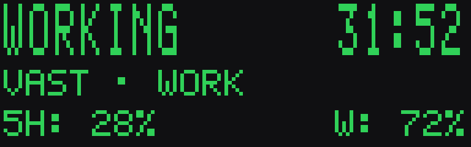
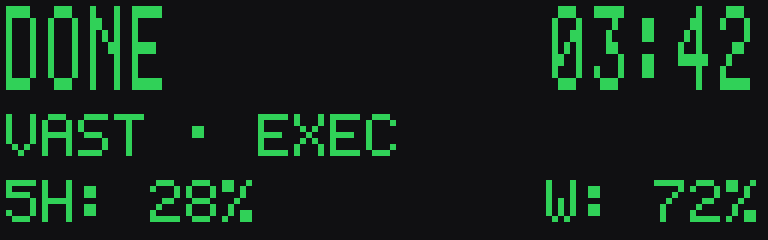
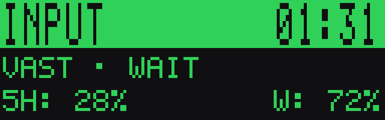
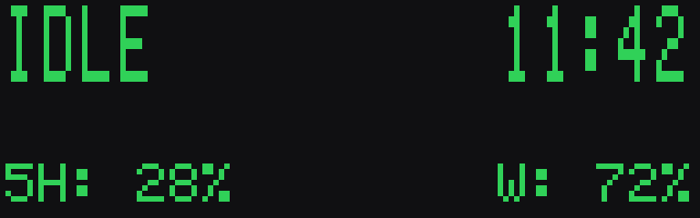

# ACS — ApexCodexStatus

Windows tray utility that mirrors live **OpenAI Codex** activity (VS Code extension or CLI)
onto the **SteelSeries Apex 5** OLED (128×40 monochrome) through the local SteelSeries GG
GameSense server.






Row 1: task state + elapsed time. Row 2: repository · what Codex is doing right now.
Row 3: plan usage left (5-hour window / weekly, from Codex's own `token_count` events).
All of it read-only — Codex files are never written and no conversation content is ever
displayed.

The tray icon uses the same color language: green = working, blue ✓ = done,
amber ! = waiting for you, red ! = failed, gray × = interrupted.

## How it works

Codex appends a JSONL rollout file per session under
`%USERPROFILE%\.codex\sessions\YYYY\MM\DD\rollout-*.jsonl`; VS Code extension sessions land
there too (`originator: codex_vscode`). ACS watches that tree with `ReadDirectoryChangesW`,
tails new bytes incrementally (byte offsets, partial-line safe, never re-reading whole
files), and folds the event stream into a small state machine:

```
codex events → normalized state → 128×40 framebuffer → GameSense frame (loopback POST)
```

Updates are event-driven: a 1 Hz tick redraws, the framebuffer is hashed, and identical
frames are never transmitted. See `docs/FINDINGS.md` for the empirically verified event
mapping and `docs/ARCHITECTURE.md` for the package design.

## Supported devices

ACS binds a GameSense handler for the **128×40** screen class (`screened-128x40`) and
renders for that canvas. It works with every keyboard GG reports in this class —
**Apex 5, Apex 7, Apex 7 TKL, Apex Pro, Apex Pro TKL** — with no per-device setup. Verified
on an Apex 5; the frame format is byte-identical across the class.

Other GameSense screens are a different class and stay untouched (nothing appears on them):

| screen | devices | supported |
|---|---|---|
| 128×40 | Apex 5 / 7 / 7 TKL / Pro / Pro TKL | yes |
| 128×36 | Arctis Nova Pro, GameDAC Gen 2 | not yet |
| 128×52 | newer Apex Pro generations | not yet |

The GameSense API allows several resolutions in a single frame (`image-data-128x36`,
`-128x40`, `-128x48`, `-128x52` in one payload — GG picks what the connected device
needs), so multi-screen support means binding the extra handlers and adding renderer
layout variants per resolution (see `docs/ARCHITECTURE.md`). Contributions welcome.

## Requirements

- Windows 10/11
- [SteelSeries GG](https://steelseries.com/gg) running (GameSense local API; the keyboard
  connected through GG as usual)
- OpenAI Codex VS Code extension or CLI (sessions under `~\.codex\sessions`)
- Nothing else: single Go binary, no admin rights, loopback traffic only

## Download / Build

Prebuilt: grab [`ACS.exe`](https://github.com/vstxx/ApexCodexStatus/releases/latest) (plus
`SHA256SUMS.txt`) from Releases — unsigned, so SmartScreen may ask for confirmation on
first run. To build instead, install [Go](https://go.dev) 1.22+ and run:

```
go build -ldflags "-s -w -H=windowsgui -X codexconnector/internal/app.Version=v0.2.0" -o bin/codexconnector.exe ./cmd/codexconnector
```

`-H=windowsgui` keeps the console hidden for the tray app. The Go module keeps the early
working name `codexconnector`; everything user-facing is ACS.

## Run

| command | what it does |
|---|---|
| `codexconnector.exe` | run the tray app (default) |
| `codexconnector.exe --console [--debug]` | run the pipeline visibly, log state changes |
| `codexconnector.exe --doctor` | diagnose GG endpoint, Codex sessions, renderer |
| `codexconnector.exe --preview [--state exec] [--out DIR]` | render layout PNGs, enlarged |
| `codexconnector.exe --testframe` | put a known test sequence on the OLED (hardware check) |
| `codexconnector.exe --inspect [--duration 30s] [--debug]` | tail live sessions, print events + state |
| `codexconnector.exe --inspect --replay FILE.jsonl` | print the timeline of a recorded session |
| `codexconnector.exe --version` | print version |

First run: `--doctor` (everything should be `[OK]`), then `--testframe` and compare the
card on the keyboard (border, corner triangles in all four corners, readable text), then
run a Codex task in VS Code and watch the OLED.

## Tray

Right-click the icon for: status header, Pause display, OLED preview (PNG of the current
frame), Diagnostics, Open config, **Autostart** (per-user Run key, no elevation), About,
Exit. Left-click opens the same menu. The icon color follows the state
(green / blue ✓ / amber ! / red ! / gray × / dim).

## Configuration

`%APPDATA%\CodexConnector\config.json` (defaults shown; created on first save; display
settings hot-reload):

```json
{
  "done_hold_seconds": 12,
  "fail_hold_seconds": 25,
  "idle_blank_minutes": 10,
  "show_clock_when_idle": true,
  "poll_interval_ms": 2000
}
```

`done_hold_seconds` / `fail_hold_seconds` are parsed for compatibility but unused —
terminal states persist. After a task finishes the OLED keeps the whole frame
(repository, last action, rates, frozen task time) with `DONE` instead of `WORKING`,
until new Codex activity starts. `idle_blank_minutes` blanks the display only in plain
`IDLE` (burn-in protection); a paused display shows a blank frame.

## What the OLED shows, and how honestly

| row | content | source |
|---|---|---|
| 1 (large) | `WORKING`, `INPUT`, `DONE`, `FAIL`, `STOP`, `IDLE` + elapsed | turn lifecycle events |
| 2 | repository · `EXEC` `EDIT` `READ` `TEST` `SEARCH` `THINK` `WORK` `WAIT` | live tool-call classification |
| 3 | `5H: n%` · `W: n%` (usage left) | `token_count` rate limits |

Detection confidence: `DONE` / `STOP` / `INPUT` certain (explicit events), `EXEC` / `EDIT`
high (pending `exec_command` / `apply_patch` calls), `READ` / `TEST` / `SEARCH` medium
(command heuristics), `FAIL` medium — current Codex builds emit **no explicit task-failure
event** (verified across ~100k rollout lines), so FAIL is inferred from a failed command
followed by a quiet turn. If Codex adds an explicit error event it will be picked up
automatically; unknown payload types are logged in debug mode.

Elapsed time is real (turn start → now, or Codex's own `duration_ms`). Progress counts come
only from Codex's own plan/todo updates — percentages are never invented.

## Keeping the OLED (why GG never overrides it)

GameSense deactivates a game that sends no events for its deinitialize window (default
15 s) and the device then shows GG's own configured content. ACS therefore registers with
the maximum `deinitialize_timer_length_ms` (60 s), sends a `game_heartbeat` every 5 s,
force-refreshes the current frame every 30 s even when unchanged, and re-registers on any
failed POST, GG restart (port re-discovered from `coreProps.json`), or 5 minutes after the
last registration. While ACS runs, it owns the OLED — including static DONE/FAIL/STOP
frames.

## Performance

Measured on the development machine, idle tray mode: **0.00 s CPU over 60 s** (below
measurement noise), ≈20 MB working set, ~7.7 MB executable. No polling loops; the only
recurring traffic is the 5 s heartbeat plus at most one frame per second when something
actually changed.

## Troubleshooting

- **Nothing on the OLED** — `--doctor`. Endpoint missing → start SteelSeries GG; ACS
  re-discovers the port automatically after GG restarts.
- **Garbled frame** — run `--testframe` and compare: full border, corner triangles in all
  four corners, unmirrored text.
- **Stuck on WORK** — an open turn with nothing pending is abandoned after 3 minutes of
  silence (crashed editor); long-running commands legitimately keep `EXEC` for hours.
- **Sessions not found** — run any Codex task once; files must exist under
  `~\.codex\sessions`.
- **Still stuck** — `--console --debug` prints every state transition; tray mode logs to
  `%APPDATA%\CodexConnector\app.log` (256 KB, rotated).

## Privacy

Local-only. No telemetry, no network beyond loopback to SteelSeries GG. Reads only the
Codex session store, GG's `coreProps.json`, and its own config/log. The OLED shows
operational metadata only — never prompts, answers, or thread names.

## License

[MIT](LICENSE). All code and the bitmap font are original. The GameSense wire format comes
from the official [gamesense-sdk documentation](https://github.com/SteelSeries/gamesense-sdk/blob/master/doc/api/).
